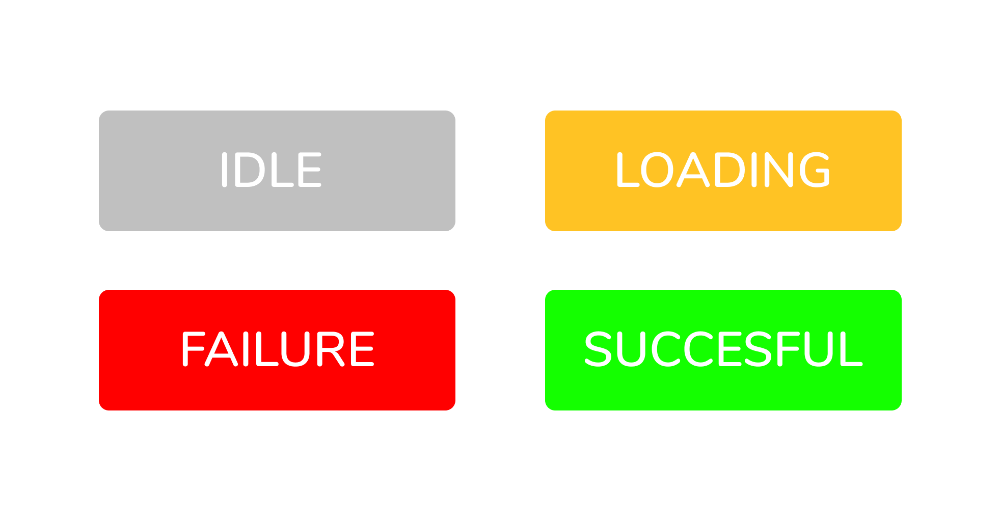
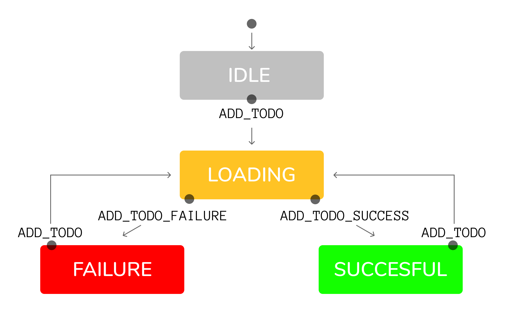

# The Problem

When developing a react + redux application, you often have to load data from a remote source such a REST API. Let's say you have a todo list application. When a user clicks 'add todo', you dispatch the corresponding `ADD_TODO` action. If the request is successful, you dispatch the success action. If the request fails, you dispatch the failure action:

```javascript
const handleClick = () => {
  dispatch({ type: ADD_TODO });
  axios
    .post("api.myapp.com/todos", { title: state.newTodoTitle })
    .then((res) => {
      dispatch({ type: ADD_TODO_SUCCESS, payload: res.data.todo });
    })
    .catch((res) => {
      dispatch({ type: ADD_TODO_FAILURE, payload: res.data.errors });
    });
};
```

You also have a reducer that handles the dispatched actions.

```javascript
const TodosReducer = (state = {}, action) => {
  switch (action.type) {
    case ADD_TODO:
      return {
        ...state,
        errors: [],
        todos: [],
      };
    case ADD_TODO_FAILURE:
      return {
        ...state,
        errors: [...action.payload],
        todos: [],
      };
    case ADD_TODO_SUCCESS:
      return {
        ...state,
        errors: [],
        todos: [...state.todos, action.payload],
      };
  }
};
```

Simple, right? But what happens when your simple application grows and becomes more complex? For example, you might want to display a spinner while the request is taking place. You also need a way to tell the view that the request was successful or failed, so that is can display the correct message to the user. You might start with boolean flags for each of these potential states such as `isLoading` and `isSuccessful`:

```javascript
const TodosReducer = (state = {}, action) => {
  switch (action.type) {
    case ADD_TODO:
      return {
        ...state,
        isLoading: true,
        isError: false,
        isSuccessful: false,
        errors: [],
        todos: [],
      };
    case ADD_TODO_FAILURE:
      return {
        ...state,
        isLoading: false,
        isError: true,
        isSuccessful: false,
        errors: [...action.payload],
        todos: [],
      };
    case ADD_TODO_SUCCESS:
      return {
        ...state,
        isLoading: false,
        isError: false,
        isSuccessful: true,
        errors: [],
        todos: [...state.todos, action.payload],
      };
  }
};
```

The above code makes sense. If the request was successful, then `isSuccessful` is set true. While the request is taking place, `isLoading` is set to true, and so on. Now let's try using the state in our react component:

```javascript
return (
  ...
  {state.isError && !state.isLoading &&
    <ErrorWrapper errors={state.errors} />
  }
  {state.isLoading && !state.isError &&
    <LoadingSpinner />
  }
  {state.isSuccessful && todos &&
    <TodosList todos={state.todos} />
  }
)
```

Things just got a whole lot more complicated... The view code is messy and unclear. No one wants a string of `if` statements in their render function. This complexity also makes it really hard to identify and handle all the potential edge cases. What if a user does something unexpected, and the state ends up looking like this?

```javascript
return {
  isLoading: true,
  isError: true,
  isSuccessful: true,
  errors: [{ id: 1, title: "my first todo " }],
  todos: ["An unexpected error occurred"],
};
```

How can a request be loading, have errors, and be successful at the same time???

Furthermore, most applications aren't that simple. What if we want to have other features, like cancelling requests after a timeout?

```ruby
if isTimedOut
  if not isLoading
    if isError
      # ...
    elsif not isError and isSuccessful
      # ...
    else
      # ...
  elsif isLoading
    # ...
else ifTimeout < 3000
  # ...
```


# What is a Finite State Machine?

In computer science, there is a computational model known as a "finite state machine". It is an abstract machine, whether a software system or computer hardware. There are two types of state machines, deterministic: and non-deterministic. The former, the one we will be working with, has the following constraints:

1. Has a finite number of states (idle, loading, successful, failure)
2. Has a finite number of actions (ADD_TODO, DELETE_TODO, etc.)
3. Has an initial state (idle) and a final state (not applicable)
4. Transitions between states in response to an action: <br/>(loading + ADD_TODO_SUCCESS = successful). <br/>Given the current state, and an action, a deterministic FSM will always return the same next state
5. Can and will only be in **one** of its finite number of states at any given time.

The fifth point is crucial. Implementing a finite state machine means that your application can and will *only* be in one potential state at a time. This is quite different from what we had before, where any number of boolean flags could be true. With a finite state machine, you do not have to worry about edge cases, because it **makes impossible states impossible**.

# Modelling the Finite State Machine

To model a finite state machine you can simple fill out the 5 constraints listed above.

1. Our application has 4 possible states.



2. Our app has 3 actions:

* `ADD_TODO`
* `ADD_TODO_SUCCESS`
* `ADD_TODO_FAILURE`

3. The application starts in the idle state.
4. Now we have to determine all the transitions that our app can go through. A transition is a response to an action. We can model these responses and state changes using a flow chart:


As you can see, the todo-list app is quite simple. It starts at the `IDLE` state. When a user adds a todo, it transitions to `LOADING`. The request returns either as a `SUCCESS`, or a `FAILURE`. If the user adds another todo, the app goes back to the `LOADING` state, and so on.

# Implementing the Finite State Machine

Now that our state machine is modelled, we can actually implement it in our application. The entire application state can be represented through one object:

```javascript
const stateMachine = Object.freeze({
  idle: {
    ADD_TODO: 'loading'
  },
  loading: {
    ADD_TODO_SUCCESS: 'successful'
    ADD_TODO_FAILURE: 'failure'
  },
  failure: {
    ADD_TODO: 'loading'
  },
  successful: {
    ADD_TODO: 'loading'
  }
})
```

As you can see, the `stateMachine` is just an object representation of our flow chart. Now, we can create a transition function. The transition function will implement the fourth constraint of deterministic FSM's:

> Given the current state, and an action, a deterministic FSM will always return the same next state. 

The transition function is very simple:

```javascript
const transition = (currentState, action) => {
  return stateMachine[currentState][action];
};

transition("idle", ADD_TODO) // => 'loading'
```

Now for the coolest part. If you haven't already noticed, the transition function *is* a reducer!

> The reducer is a pure function that takes the previous state and an action, and returns the next state. - [redux.js.org](https://redux.js.org/basics/reducers)

And that is exactly what our function does. With a few modifications, we can convert it into a redux style reducer:

```javascript
const TransitionReducer = (state = { status: "idle" }, action) => {
    if (stateMachine[action.type] != undefined) {
      return { status: stateMachine[state.status][action.type] }
    } else { return state }
};
```

That's it! in 5 lines of code, we can intercept all actions and calculate the new application state without having to worry about any edge cases! Our todos reducer now looks much simpler:

```javascript
// reducer
const TodosReducer = (state = {}, action) => {
  switch (action.type) {
    case ADD_TODO_FAILURE:
      return {
        ...state,
        errors: [...action.payload],
      };
    case ADD_TODO_SUCCESS:
      return {
        ...state,
        errors: [],
        todos: [...state.todos, action.payload],
      };
  }
};
```

And so does our component:

```javascript
// view
return (
  ...
  {state.status === 'failure' && <ErrorWrapper errors={state.errors} />}
  {state.status === 'loading' && <LoadingSpinner />}
  {state.status === 'successful' && <TodosList todos={state.todos} />}
)
```

# Takeaways

The biggest gain from this pattern is that no matter what the user does, our application will always be in one of 4 predetermined states. It also brings single purpose reducers; reducers that handle one process and one process only. Those two combined give simplicity to the entire application: reducers, views, and actions.

# References:

- [Infinitely Better UIs with Finite Automata](https://www.youtube.com/watch?v=VU1NKX6Qkxc)
- [Solving the Boolean Identity Crisis](https://www.youtube.com/watch?v=6TDKHGtAxeg).
 - [Shrug emoji](https://twemoji.twitter.com/)
