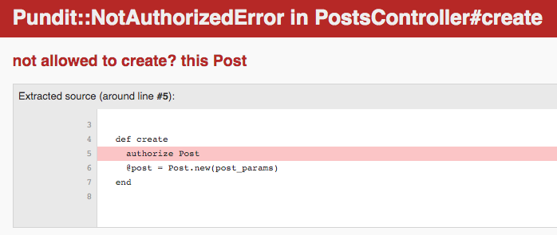

[Pundit](https://github.com/varvet/pundit) is a minimal authorization gem that implements object-oriented design and plain old ruby classes (PORO). Today, we will be recreating the gem to get a better understanding of Pundit and object-oriented design.

Pundit's entire authorization system is built around a method called authorize. You create policy classes for every controller, and methods corresponding to every action. For example, if you have a post's controller, you might want to make a call to authorize and pass in the Post class.

```ruby
def create
  authorize Post
  @post = Post.new(post_params)
  if @post.save
    redirect_to @post, notice: 'Post was successfully created.'
  else
    render :new
  end
end
```

Now in your post policy, you can make authorization decisions based on the current user and the specific record,  if there is one. In this example, only admins are allowed to create posts:

```ruby
class PostPolicy
  attr_reader :user, :record

  def initialize(user, record)
    @user = user
    @record = record
  end
  
  def create?
    user.admin?
  end
end
```

The policy method simply returns a boolean which if false, raises the `Pundit::NotAuthorizedError`: 



For actions that involve specific resources, such as an update, you can pass the post instance to authorize:

```ruby
def update
  @post = Post.find(params[:id])
  authorize @post
  ...
end
```

## The Authorizer Module

We can start our recreation of Pundit my creating a module called Authorizer which will contain all of our authorization logic, and include it in our ApplicationController:

```ruby
# app/controllers/application_controller.rb
class ApplicationController < ActionController::Base
  include Authorizer
end

# app/controllers/concerns/authorizer.rb
module Authorizer
end
```

Ok, now we can write the authorize method. The authorize method takes a record and returns that record if the corresponding policy method returns true. Otherwise, it raises the NotAuthorizedError:

```ruby
def authorize(record)
  return record if policy...
  raise NotAuthorizedError.new(query: query, record: record)
end
```

The NotAuthorizedError class inherits from Ruby's Error. It takes a query and a record, and returns a call to super, passing in a helpful error message:

```ruby
class NotAuthorizedError < StandardError
  def initialize(options = {})
    @query  = options[:query]
    @record = options[:record]
    message = "not allowed to #{@query} this #{@record.model_name}"
    super(message)
  end
end
```

Cool! Now, we have to find a way to get the policy class and method we need from the authorize method. We can find the class through a find_policy method:

```ruby
def find_policy(record)
  policy = "#{record.model_name}#{"Policy"}".safe_constantize
  policy.new(current_user, record)
end
```

The find\_policy method finds the class based on a string containing the record's model name and the keyword "Policy". For example, if you pass in a post instance, the policy string will be `PostPolicy`. It then calls safe\_constantize, which will return the policy class with the same name as the policy string. Finally, it returns a new instance of the policy class, passing in the current user and record.

Now we have to find the corresponding policy action method. We could pass in the action with each call to authorize, but Rails provides us with an easier way. We can use the action\_name method, which returns the name of the controller action and append a question mark. We can then use the policy class we found, and send the method name using public\_send:

```ruby
def authorize(record)
  query = "#{action_name}?"
  return record if find_policy(record).public_send(query)
  raise NotAuthorizedError.new(query: query, record: record)
end
```

The complete Authorizer module should look like this:

```ruby
module Authorizer
  def authorize(record)
    query = "#{action_name}?"
    return record if find_policy(record).public_send(query)
    raise NotAuthorizedError.new(query: query, record: record)
  end
  
  def find_policy(record)
    policy = "#{record.model_name}#{"Policy"}".safe_constantize
    policy.new(current_user, record)
  end

  class NotAuthorizedError < StandardError
    def initialize(options = {})
      @query  = options[:query]
      @record = options[:record]
      message = "not allowed to #{@query} this #{@record.model_name}"
      super(message)
    end
  end
end
```

We can use inheritance to remove some boilerplate from our policy classes by creating an ApplicationPolicy with some useful defaults:

```ruby
class ApplicationPolicy
  attr_reader :user, :record

  def initialize(user, record)
    @user = user
    @record = record
  end

  def index?
    false
  end

  def show?
    false
  end

  def create?
    false
  end

  def new?
    create?
  end

  def update?
    false
  end

  def edit?
    update?
  end

  def destroy?
    false
  end
end
```

The PostPolicy now looks like this:

```ruby
class PostPolicy < ApplicationPolicy
  def create?
    false
  end
end
```

We re-created a simple version of the pundit gem in 21 lines of code! Hopefully, you now have a better understanding of Pundit and object-oriented design.
